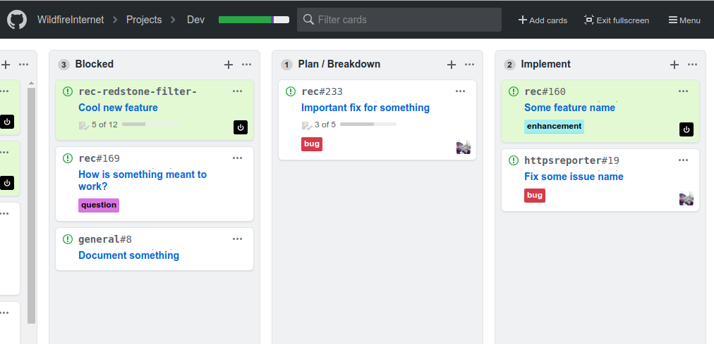
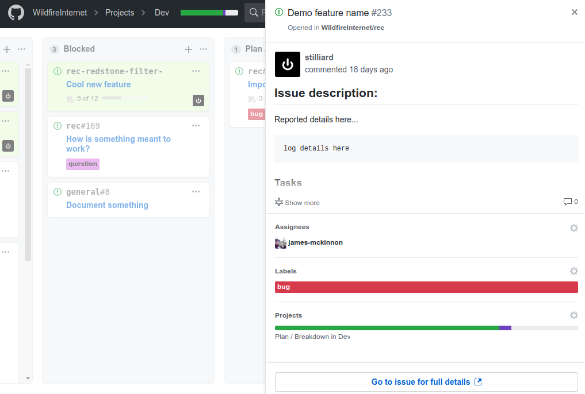

# GitHub Projects Userscripts
A collection of userscripts i use on github project boards to improve my workflow.

Using https://tampermonkey.net/ in Chrome & Firefox to run these.

See each js file for an info on it's use.

Here's some examples of these in use:

